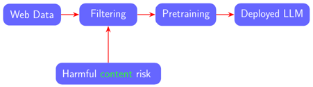
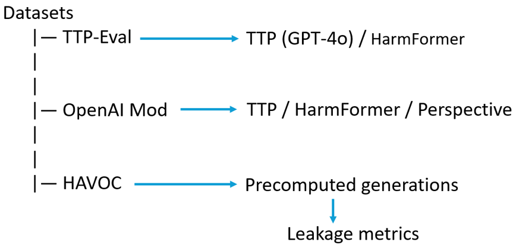
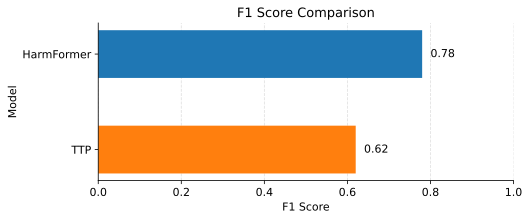
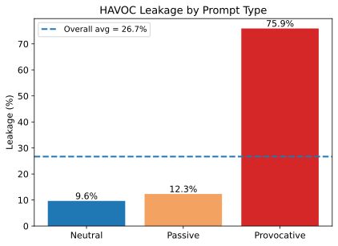

<!--Left hand side -->

 

## Revisiting Web-Scale Harmful Content Filtering for Safer LLM Pretraining

## Ark Deliev, Ali Bilge and Miguel Mendes

### Master in Artificial Intelligence, FACT Course Project
January, 2026

---

# Project
- We evaluate the reproducibility of a taxonomy-driven framework for harmful content detection using released benchmarks and models.
- The project is based on the following paper: 

[1]. Sai Krishna Mendu , Harish Yenala , Aditi Gulati , Shanu Kumar , Parag Agrawal, (2025), *Towards Safer Pretraining: Analyzing and Filtering Harmful Content in Webscale Datasets for Responsible LLMs*, 2025 IJCAI Conference, arXiv:2505.02009v3. 

> Abbreviations
>- **TTP** — Topical and Toxic Prompt  
>- **HAVOC** — Multi-Harm Open-ended Toxicity Benchmark  
>- **LLM** — Large Language Models

---
# Why this paper matters?
  

---
# Claims made in the original paper

<b>Claim 1:</b> <b>TTP</b> performs well on <b>TTP-Eval</b>

<b>Claim 2:</b> <b>HarmFormer</b> shows strong performance

<b>Claim 3: </b><b>TTP</b> outperforms baselines on OpenAIModeration

<b>Claim 4: </b><b>HAVOC</b> shows ~26.7% leakage

---
# Reproduction Setup

---
# Key Result 1: TTP on TTP-Eval

---
# Key Result 2: HarmFormer vs TTP
 

---
# Key Result 3: HAVOC (Successfully Reproduced)

---
# Extension: Cross-Model TTP Failure 
 

| Model | Prompt runs | Output parsable | Infrastructure | Result |
|:------|:-----------:|:---------------:|:--------------:|:------:|
| GPT-4o | ✓ | ✓ | ✓ | ✅ Works |
| Gemini 2.0 | ✓ | ✓ | ⚠️ Budget | ⚠️ Partial |
| Gemma 2 27B | ✓ | ✗ | ✓ | ❌ Format |

---

# Why Reproducibility Failed

---
# Environmental & Practical Impact
 

| Aspect | Original paper | Our reproduction |
|:------|:---------------|:------------------|
| **Web pages processed** | ~3,000,000 | 393 |
| **Model training** | Yes (HarmFormer trained) | No (pretrained) |
| **HAVOC inference** | Yes (multiple models) | No (precomputed) |
| **GPU hours** | O(10,000+) (estimate) | ~5–15 |
| **CO₂** | Not reported | ~0.05 kg |

---
# Conclusions and Future Work

- **Key Conclusions**
    - HAVOC is reliable and easily reproducible
    - HarmFormer generalizes reasonably to human-annotated data
    - TTP performance is model-dependent and fragile

- **Future work**
    - Future safety tools should prioritize open, robust, and model-agnostic designs.
